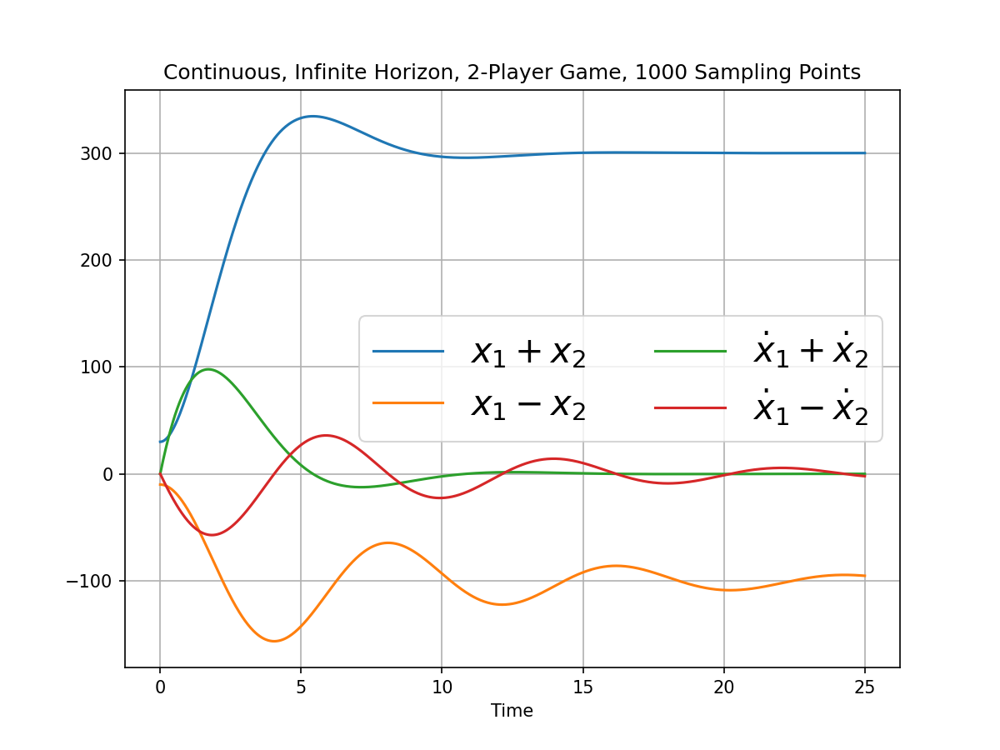
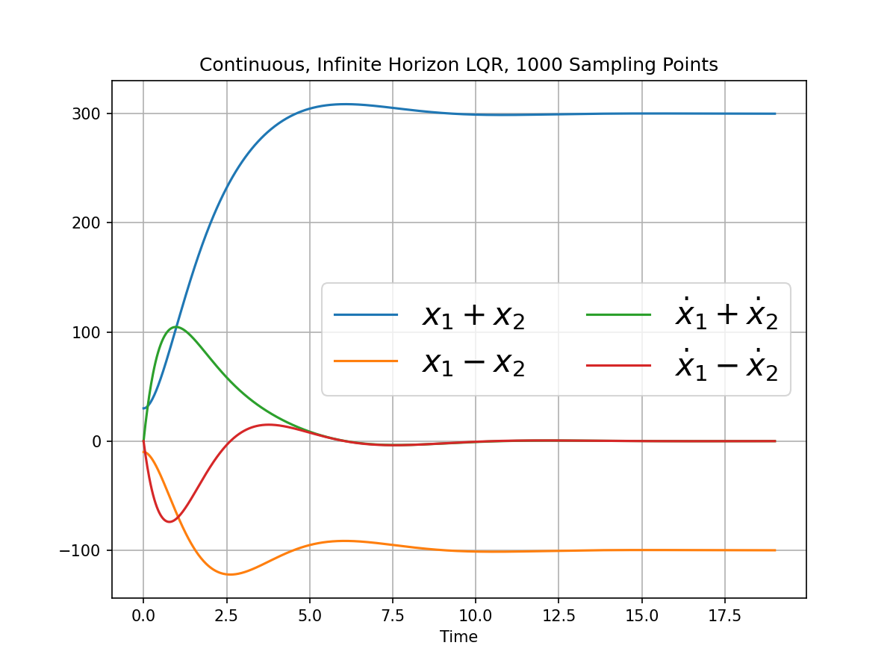
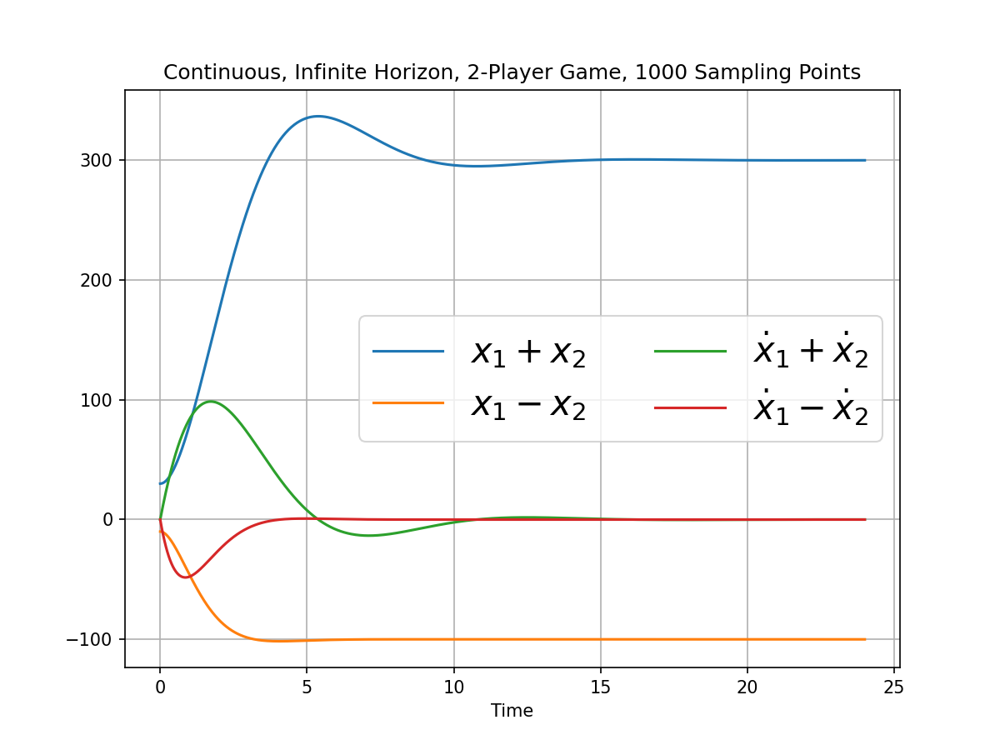

<p align="center">
    
</p>

  * [What is this?](#what-is-this)
  * [Local Installation](#local-installation)
  * [Input Parameters](#input-Parameters)

# Additional Information
  * [Mathematical Description](Math.md)
  * [Supported Scenarios](Scenarios.md)
  * [References](Math.md#references)

# What is this?
`PyDiffGame` is a Python implementation of a multi-objective control systems simulator based on Nash Equilibrium differential game. 
The method relies on the formulation given in:

 - The thesis work "_Differential Games for Compositional Handling of Competing Control Tasks_"
   ([Research Gate](https://www.researchgate.net/publication/359819808_Differential_Games_for_Compositional_Handling_of_Competing_Control_Tasks))

 - The conference article "_Composition of Dynamic Control Objectives Based on Differential Games_" 
([IEEE](https://ieeexplore.ieee.org/document/9480269) | 
[Research Gate](https://www.researchgate.net/publication/353452024_Composition_of_Dynamic_Control_Objectives_Based_on_Differential_Games))

# Local Installation
To clone Git repository locally run this from the command prompt:
```
git clone https://github.com/krichelj/PyDiffGame.git
```

# Input Parameters

The package contains a file named `PyDiffGame.py` and an abstract class of the same name. An object of this class represents an instance of differential game. 
Once the object is created, it can be simulated using the `run_simulation` class method.
All the constants are defined in the [Mathematical Description](Math.md) section.
The input parameters to instantiate a `PyDiffGame` object are:

* `A` : 2-d `np.array` of shape( $n,n$ )
>The system dynamics matrix
* `B` : `list` of 2-d `np.array` objects of len( $N$ ), each array $B_i$ of shape( $n,m_i$ )
>System input matrices for each control objective
* `Q` : `list` of 2-d `np.array` objects of len( $N$ ), each array $Q_i$ of shape( $n,n$ )
>Cost function state weights for each control objective
* `R` : `list` of 2-d `np.array` objects of len( $N$ ), each array $R_i$ of shape( $m_i,m_i$ )
>Cost function input weights for each control objective
* `x_0` : 1-d `np.array` of len( $n$ ), optional
>Initial state vector
* `x_T` : 1-d `np.array` of len( $n$ ), optional
>Final state vector, in case of signal tracking
* `T_f` : positive `float`, optional, default = `10`
>System dynamics horizon. Should be given in the case of finite horizon
* `P_f` : `list` of 2-d `np.array` objects of len( $N$ ), each array $P_{f_i}$ of shape( $n,n$ ), optional, default = uncoupled solution of `scipy's solve_are`
>
>Final condition for the Riccati equation array. Should be given in the case of finite horizon
* `show_legend` : `boolean`, optional, default = `True`
>Indicates whether to display a legend in the plots
* `state_variables_names` : `list` of `str` objects of len( $n$ ), optional
>The state variables' names to display
* `epsilon` : `float` in the interval $(0,1)$, optional, default = `10e-7`
>Numerical convergence threshold
* `L` : positive `int`, optional, default = `1000`
>Number of data points
* `eta` : positive `int`, optional, default = `5`
>The number of last matrix norms to consider for convergence
* `debug` : `boolean`, optional, default = `False`
>Indicates whether to display debug information


# Tutorial

Consider the following system of masses and springs:

```math
\begin{tikzpicture}
 \draw (0,0) circle (2cm);
\end{tikzpicture}
```

This example is based on a 'Hello-World' example explained in the M.Sc. thesis showcasing this work, which can be found [here](https://www.researchgate.net/publication/359819808_Differential_Games_for_Compositional_Handling_of_Competing_Control_Tasks).
The code can be found [here](src/PyDiffGame/examples/MassesWithSpringsComparison.py).
Let us consider the following input parameters for the instantiation of an `MassesWithSpringsComparison` object and 
corresponding call for `run_multiprocess`:

```python
import numpy as np
from typing import Sequence, Optional

from PyDiffGame.PyDiffGame import PyDiffGame
from PyDiffGame.PyDiffGameLQRComparison import PyDiffGameLQRComparison
from PyDiffGame.Objective import GameObjective, LQRObjective


class MassesWithSpringsComparison(PyDiffGameLQRComparison):
    def __init__(self,
                 N: int,
                 m: float,
                 k: float,
                 q: float | Sequence[float],
                 r: float,
                 Ms: Optional[Sequence[np.array]] = None,
                 x_0: Optional[np.array] = None,
                 x_T: Optional[np.array] = None,
                 T_f: Optional[float] = None,
                 epsilon_x: Optional[float] = PyDiffGame.epsilon_x_default,
                 epsilon_P: Optional[float] = PyDiffGame.epsilon_P_default,
                 L: Optional[int] = PyDiffGame.L_default,
                 eta: Optional[int] = PyDiffGame.eta_default):
        N_e = np.eye(N)
        N_z = np.zeros((N, N))
        M_masses = m * N_e
        K = k * (2 * N_e - np.array([[int(abs(i - j) == 1) for j in range(N)] for i in range(N)]))
        M_masses_inv = np.linalg.inv(M_masses)
        M_inv_K = M_masses_inv @ K

        if Ms is None:
            eigenvectors = np.linalg.eig(M_inv_K)[1]
            Ms = [eigenvector.reshape(1, N) / eigenvector[0] for eigenvector in eigenvectors]

        A = np.block([[N_z, N_e],
                      [-M_inv_K, N_z]])
        B = np.block([[N_z],
                      [M_masses_inv]])

        Qs = [np.diag([0.0] * i + [q] + [0.0] * (N - 1) + [q] + [0.0] * (N - i - 1))
              if isinstance(q, (int, float)) else
              np.diag([0.0] * i + [q[i]] + [0.0] * (N - 1) + [q[i]] + [0.0] * (N - i - 1)) for i in range(N)]

        M = np.concatenate(Ms,
                           axis=0)
        Q_mat = np.kron(a=np.eye(2),
                        b=M)

        Qs = [Q_mat.T @ Q @ Q_mat for Q in Qs]
        Rs = [np.array([r])] * N
        R_lqr = r * N_e
        Q_lqr = q * np.eye(2 * N) if isinstance(q, (int, float)) else np.diag(2 * q)

        state_variables_names = ['x_{' + str(i) + '}' for i in range(1, N + 1)] + \
                                ['\\dot{x}_{' + str(i) + '}' for i in range(1, N + 1)]
        args = {'A': A,
                'B': B,
                'x_0': x_0,
                'x_T': x_T,
                'T_f': T_f,
                'state_variables_names': state_variables_names,
                'epsilon_x': epsilon_x,
                'epsilon_P': epsilon_P,
                'L': L,
                'eta': eta,
                'force_finite_horizon': T_f is not None}

        lqr_objective = [LQRObjective(Q=Q_lqr,
                                      R_ii=R_lqr)]
        game_objectives = [GameObjective(Q=Q,
                                         R_ii=R,
                                         M_i=M_i) for Q, R, M_i in zip(Qs, Rs, Ms)]
        games_objectives = [lqr_objective,
                            game_objectives]

        super().__init__(args=args,
                         M=M,
                         games_objectives=games_objectives,
                         continuous=True)


def multiprocess_worker_function(N: int,
                                 k: float,
                                 m: float,
                                 q: float,
                                 r: float,
                                 epsilon_x: float,
                                 epsilon_P: float):
    x_0_vals = [10 * i for i in range(1, N + 1)]
    x_0 = np.array(x_0_vals + [0] * N)
    x_T = 10 * x_0

    masses_with_springs = MassesWithSpringsComparison(N=N,
                                                      m=m,
                                                      k=k,
                                                      q=q,
                                                      r=r,
                                                      x_0=x_0,
                                                      x_T=x_T,
                                                      epsilon_x=epsilon_x,
                                                      epsilon_P=epsilon_P)
    output_variables_names = ['$x_1 + x_2$', '$x_1 - x_2$', '$\\dot{x}_1 + \\dot{x}_2$', '$\\dot{x}_1 - \\dot{x}_2$']
    masses_with_springs(plot_state_spaces=True,
                        plot_Mx=True,
                        output_variables_names=output_variables_names,
                        save_figure=True
                        )


if __name__ == '__main__':
    Ns = [2]
    ks = [10]
    ms = [50]
    qs = [[500, 50]]
    rs = [1]
    epsilon_xs = [10e-8]
    epsilon_Ps = [10e-8]

    params = [Ns, ks, ms, qs, rs, epsilon_xs, epsilon_Ps]
    PyDiffGameLQRComparison.run_multiprocess(multiprocess_worker_function=multiprocess_worker_function,
                                             values=params)
```

This will result in the following plot that compares the two systems performance for a differential game vs an LQR:

<p align="center">
    
    
</p>


And when tweaking the weights by setting

```python
qs = [[500, 5000]]
```

we have: 

<p align="center">
    
    
</p>


# Acknowledgments
This research was supported in part by the Helmsley Charitable Trust through the Agricultural, Biological and Cognitive Robotics Initiative and by the Marcus Endowment Fund both at Ben-Gurion University of the Negev, Israel.
This research was also supported by The Israeli Smart Transportation Research Center (ISTRC) by The Technion and Bar-Ilan Universities, Israel.

<p align="center">
    <a href="https://istrc.net.technion.ac.il/">
    
    </a>
&emsp;
&emsp;
&emsp;
&emsp;
<a href="https://in.bgu.ac.il/en/Pages/default.aspx">

</a>
&emsp;
&emsp;
&emsp;
&emsp;
<a href="https://in.bgu.ac.il/en/robotics/Pages/default.aspx">

</a>
</p>
